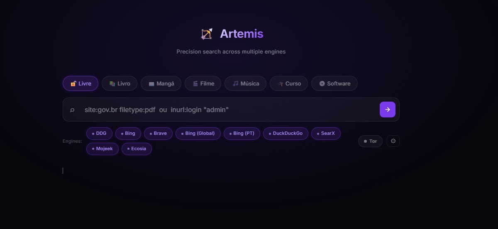

```
    _         _                     _     
   / \   _ __| |_ ___ _ __ ___  (_)___
  / _ \ | '__| __/ _ \ '_ ` _ \ | / __|
 / ___ \| |  | ||  __/ | | | | || \__ \
/_/   \_\_|   \__\___|_| |_| |_|/ |___/
                               |__/     
```

<div align="center">

**Búsqueda precisa. Múltiples motores. Soporte para Tor.**

[](https://python.org)
[](https://flask.palletsprojects.com)
[](LICENSE)

[🇧🇷 Português](../README.md) · [🇺🇸 English](README.en.md) · 🇪🇸 Español · [📖 Wiki](../../wiki)

</div>

---



---

## Instalación

```bash
python -m venv .venv
.venv\Scripts\activate        # Windows
# source .venv/bin/activate   # Linux/Mac

pip install -r requirements.txt
```

## Configuración (opcional)

```bash
cp .env.example .env
```

| Variable | Descripción |
|---|---|
| `VIRUSTOTAL_API_KEY` | Verificación de seguridad de URLs |
| `BRAVE_API_KEY` | Motor Brave Search vía API oficial |
| `TOR_PROXY` | Ej: `socks5://127.0.0.1:9050` |

Sin ninguna clave, Artemis funciona con 10 motores gratuitos + motores personalizados vía Engine Manager.

---

## Uso

### Web App

```bash
python artemis.py web
# → http://127.0.0.1:5000
```

### CLI

```bash
python artemis.py search "site:gov.br filetype:pdf"
python artemis.py search "inurl:login" --engines ddg,bing
python artemis.py search "intext:password" --vt --max 20
```

---

## Motores de búsqueda

### Surface Web
| Slug | Motor |
|---|---|
| `ddghtml` | DuckDuckGo HTML |
| `bing` | Bing |
| `google` | Bing Global (en-GB) |
| `startpage` | Bing (pt-BR) |
| `ddg` | DuckDuckGo API |
| `searx` | SearXNG (instancias públicas, orden aleatorio) |
| `mojeek` | Mojeek |
| `ecosia` | Ecosia |
| `brave_html` | Brave Search (scraper) |
| `brave` | Brave API *(requiere clave)* |

### Red .onion *(requiere Tor activo)*
| Slug | Motor | Descripción |
|---|---|---|
| `ahmia` | Ahmia | Índice más actualizado de la dark web |
| `torch` | Torch | Pionero, gran volumen de enlaces |
| `haystack` | Haystack | Enfocado en privacidad |

---

## Tor — bypass y dark web

```bash
python artemis.py tor install   # descarga el bundle oficial en .tor/
python artemis.py tor start     # inicia en segundo plano
python artemis.py tor stop      # detiene el proceso
```

O usa el panel **⚙** junto al badge Tor en la web app para control completo sin CLI.

Tor sirve para **dos cosas**:
- **Bypass** — rotación de IP vía exit nodes, evita rate-limiting en motores normales
- **Dark web** — acceso directo a motores `.onion` (Ahmia, Torch, Haystack) vía la red Tor

> El bundle se descarga directamente desde `archive.torproject.org`. No se instala nada en el sistema.

---

## Funcionalidades

- 🔍 **Multi-motor** — 10+ motores en paralelo con deduplicación
- 🛡 **Anti-bloqueo** — rotación de UA, headers aleatorios, reintentos con backoff
- 🧅 **Tor modo dual** — bypass de scraping + búsqueda en dark web (Ahmia, Torch, Haystack)
- 🔌 **Gestor de motores** — agrega motores personalizados desde el panel, con health check y auto-detección de selectores
- 🌐 **Interfaz multilingüe** — PT 🇧🇷 / EN 🇺🇸 / ES 🇪🇸
- 📋 **Copiar URL** con un clic
- 🕒 **Historial de búsquedas** (localStorage, últimas 10)
- 🔽 **Exportar** resultados en JSON o CSV
- 🔎 **Filtrar por motor** después de buscar (incluye filtro exclusivo 🧅 Onion)
- 🛡 **VirusTotal** inline por resultado
- 🏹 **Constructor de dorks** con operadores extra (`site:`, `before:`, `after:`), preview coloreado
- 🎯 **Sitios objetivo** — campo de operadores extra en panel avanzado

---

## Gestor de motores

Haz clic en el botón **🔌** junto al badge de Tor para abrir el panel de motores personalizados.

- **Agregar motor** — proporciona URL, método, parámetros y selectores CSS
- **Auto-detectar selectores** — Artemis obtiene la página e infiere los selectores automáticamente
- **Health check** — prueba si el motor devuelve resultados (`ok` / `degraded` / `offline`)
- **Activar/Desactivar** — sin eliminar la configuración
- **Persistencia** — configuración guardada en `dorks_tool/engines.json`

---

<div align="center">
  <sub>By <strong>Tonnks</strong></sub>
</div>
